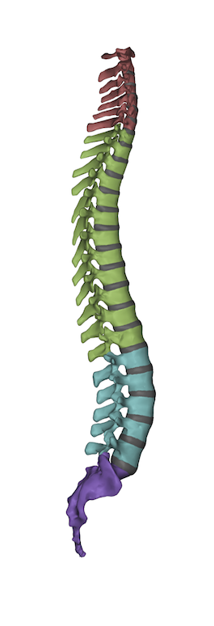

<h1>
<a id="bodyparts3d-in-matlab" class="anchor" href="#bodyparts3d-in-matlab" aria-hidden="true"></a>BodyParts3D in Matlab</h1>

This small collection of functions can be used to load and plot items from the BodyParts3D database.
This database is used for the <a href="http://lifesciencedb.jp/bp3d/?lng=en">Anatomography website</a>. 

<h2>
<a id="usage" class="anchor" href="#usage" aria-hidden="true"></a>Usage</h2>

It's pretty easy — check out the example file <code>example_body_parts.m</code>.
Basically, run the command <code>find_body_parts(regex)</code> to search for body parts in the database; e.g.,

<pre><code>find_body_parts('bone organ .* vertebra')
find_body_parts('vocalis')
</code></pre>

When that returns the part(s) you wish to display, add an output as so:

<pre><code>parts = find_body_parts('/ cervical vertebra /');
displ_body_parts(parts)
</code></pre>

Colour and opacity can be selected using additional options to <code>displ_body_parts()</code> as shown in the example file, which produces the rather attractive image following: (if I say so myself)

